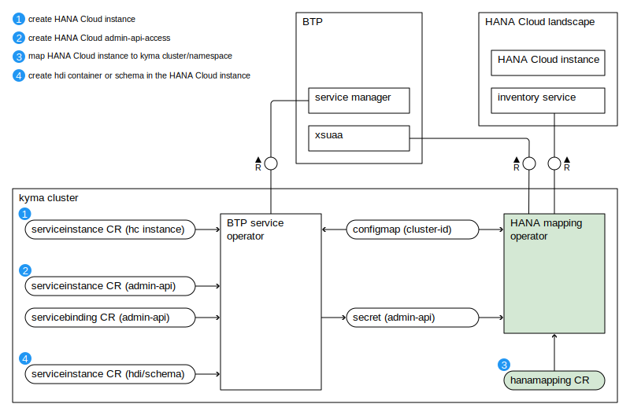

# SAP-samples/repository-template
This default template for SAP Samples repositories includes files for README, LICENSE, and .reuse/dep5. All repositories on github.com/SAP-samples will be created based on this template.

# Containing Files

1. The LICENSE file:
In most cases, the license for SAP sample projects is `Apache 2.0`.

2. The .reuse/dep5 file: 
The [Reuse Tool](https://reuse.software/) must be used for your samples project. You can find the .reuse/dep5 in the project initial. Please replace the parts inside the single angle quotation marks < > by the specific information for your repository.

3. The README.md file (this file):
Please edit this file as it is the primary description file for your project. You can find some placeholder titles for sections below.

# HANA Cloud Instance Mapping Operator for Kyma
HANA Cloud Instance Mapping Operator automates the HANA Cloud database mapping to a Kyma namespace.

<!--- Register repository https://api.reuse.software/register, then add REUSE badge:
[](https://api.reuse.software/info/github.com/SAP-samples/REPO-NAME)
-->

## Description
The operator manages the database mappings in a kubernetes-native way. It stores them in custom resources (CRs) in the Kyma cluster and updates the underlying HANA Cloud infrastructure by calling its mapping API.

The following diagram gives an overview of the involved custom resources (CRs) and operators in the Kyma cluster.


Database mappings are a prerequisite for deploying and consuming HDI Containers and Schemas from a Kyma namespace. 
General information about provisioning and consuming HANA Cloud databases is available on the SAP Technology Blog:
* [Provisioning HANA Cloud Databases in Kyma - concepts](https://community.sap.com/t5/technology-blogs-by-sap/provisioning-sap-hana-cloud-databases-from-kyma-and-kubernetes-1-concepts/ba-p/13577178)
* [Provisioning HANA Cloud Databases in Kyma - step-by-step](https://community.sap.com/t5/technology-blogs-by-sap/provisioning-sap-hana-cloud-databases-from-kyma-and-kubernetes-2-kyma/ba-p/13577215)
* [Consuming HANA Cloud in Kyma](https://community.sap.com/t5/technology-blogs-by-sap/consuming-sap-hana-cloud-from-the-kyma-environment/ba-p/13552718)

## Requirements
- go version v1.21.0+
- docker version 17.03+.
- kubectl version v1.11.3+.
- Access to a Kubernetes v1.11.3+ cluster.
- [SAP BTP Service Operator](https://github.com/SAP/sap-btp-service-operator) running on your Kyma cluster

## Installation

### To Deploy on the cluster
**Build and push your image to the location specified by `IMG`:**

```sh
make docker-build docker-push IMG=<some-registry>/hana-mapping-operator:tag
```

**NOTE:** This image ought to be published in the personal registry you specified. 
And it is required to have access to pull the image from the working environment. 
Make sure you have the proper permission to the registry if the above commands don’t work.

**Install the CRDs into the cluster:**

```sh
make install
```

**Deploy the Manager to the cluster with the image specified by `IMG`:**

```sh
make deploy IMG=<some-registry>/hana-mapping-operator:tag
```

> **NOTE**: If you encounter RBAC errors, you may need to grant yourself cluster-admin 
privileges or be logged in as admin.

**Create instances of your solution**
You can apply the samples (examples) from the config/sample:

```sh
kubectl apply -k config/samples/
```

>**NOTE**: Ensure that the samples has default values to test it out.

### To Uninstall
**Delete the instances (CRs) from the cluster:**

```sh
kubectl delete -k config/samples/
```

**Delete the APIs(CRDs) from the cluster:**

```sh
make uninstall
```

**UnDeploy the controller from the cluster:**

```sh
make undeploy
```

## Usage
First, make sure you have a database (HANA Cloud service instance) in your landscape. One way to provision it is by deploying a ServiceInstance CR like:
```yaml
apiVersion: services.cloud.sap.com/v1
kind: ServiceInstance
metadata:
  namespace: my-namespace
  name: my-hana-instance
spec:
  serviceOfferingName: hana-cloud
  servicePlanName: hana
  parameters:
    data:
      memory: 30
      vcpu: 2
      generateSystemPassword: true
```

To get access to the mapping API (inventory service) of the HANA Cloud infrastructure the HANA Mapping Operator needs to authenticate against a special XSUAA service. Provision one service instance (plan admin-api-access) and the corresponding binding. Don't forget to set the `technicalUser` flag, it assigns all necessary scopes to access the mapping API:
```yaml
apiVersion: services.cloud.sap.com/v1
kind: ServiceInstance
metadata:
  namespace: my-namespace
  name: my-admin-instance
spec:
  serviceOfferingName: hana-cloud
  servicePlanName: admin-api-access
  parameters:
    technicalUser: true
---
apiVersion: services.cloud.sap.com/v1
kind: ServiceBinding
metadata:
  namespace: my-namespace
  name: my-admin-binding
spec:
  serviceInstanceName: my-admin-instance
  secretName: my-admin-secret
```

The credentials for authentication will be stored in a separate secret `my-admin-secret` in the same namespace as the binding.

Next, deploy the mapping CR:
```yaml
apiVersion: hana.cloud.sap.com/v1
kind: HANAMapping
metadata:
  namespace: my-namespace
  name: my-hanamapping
spec:
  btpOperatorConfigmap:
    namespace: kyma-system
    name: sap-btp-operator-config
  adminAPIAccessSecret:
    namespace: my-namespace
    name: my-admin-secret
  mapping:
    serviceInstanceID: cf923d7d-7661-48f2-aaa2-d4dbb151a708
    targetNamespace: my-namespace
```

Finally, make sure the mapping is deployed successfully:
```shell
$ kubectl get hanamappings
NAME             SERVICE INSTANCE ID                    TARGET NAMESPACE   READY
my-hanamapping   cf923d7d-7661-48f2-aaa2-d4dbb151a708   my-namespace       True
```

Now, you can consume the specified HANA Cloud Service Instance in `my-namespace`.

## Known Issues
No known issues.

## How to obtain support
[Create an issue](https://github.com/SAP-samples/hana-cloud-instance-mapping-operator-for-kyma/issues) in this repository if you find a bug or have questions about the content.
 
For additional support, [ask a question in SAP Community](https://answers.sap.com/questions/ask.html).

## Contributing
If you wish to contribute code, offer fixes or improvements, please send a pull request. Due to legal reasons, contributors will be asked to accept a DCO when they create the first pull request to this project. This happens in an automated fashion during the submission process. SAP uses [the standard DCO text of the Linux Foundation](https://developercertificate.org/).

## License
Copyright (c) 2024 SAP SE or an SAP affiliate company. All rights reserved. This project is licensed under the Apache Software License, version 2.0 except as noted otherwise in the [LICENSE](LICENSE) file.
